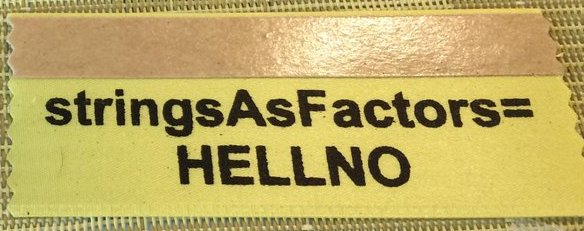

```{r setup, include=FALSE}
library(knitr)
library(tidyverse)
options(htmltools.dir.version = FALSE,
        tibble.width = 70,
        ggplot2.continuous.colour = "viridis",
        ggplot2.continuous.fill = "viridis")
opts_chunk$set(
  fig.width = 6.5,
  fig.height = 4.5,
  fig.align = "center",
  cache = TRUE
)
theme_set(theme_bw() +
            theme(text = element_text(size = 20))) 
```

# What are factors?

R's representation of categorical variable. Consists of:

1. A set of values
2. An ordered set of valid levels

```{r}
eyes <- factor(c("blue", "green", "green"),
               levels = c("blue", "brown", "green"))
eyes
```

---

# Why care?

By default, `stringsAsFactors = TRUE` when you use `read.csv()`

It's easy to get tripped up by factors if you don't understand how they work...or even if you do
---
class: inverse, middle, center

# Some examples

---

## What you see is not what you get

```{r}
treatment <- c(50, 0, 50, 100)
treatment
```
--
```{r}
treatment_f <- factor(treatment)
treatment_f
```
--
```{r}
as.numeric(treatment_f)
```

---

class: middle, center

# Factors are stored as _integers_

---
## Let's take two data frames...

```{r echo = FALSE}
library(tidyverse)
a <- tibble(name = c("Alon", "Ela", "Shaked"),
            drink = factor(c("coffee", "beer", "beer")))

b <- tibble(name = c("Oren", "Erez"),
            drink = factor(c("coffee", "lemonade")))
```

.pull-left[
```{r}
a
b
```
]

---

## R sometimes handles factor magic for you...

.pull-left[
```{r}
a
b
```
]

.pull-right[
```{r}
rbind(a, b) #<<
```
]
---

## Other times, it fails without warning
.pull-left[
```{r}
a
b
```
]

.pull-right[
```{r}
c(a$drink, b$drink) #<<
```
]
---

## The tidyverse is "lazy and surly" -- it reminds you to pay attention!
.pull-left[
```{r}
a
b
```
]

.pull-right[
```{r}
bind_rows(a, b) #<<
```
]
---

<blockquote class="twitter-tweet tw-align-center" data-lang="en"><p lang="en" dir="ltr">10 years after convincing all scientists to switch to R: &quot;10% of genetics papers contain error due to stringsAsFactors&quot;</p>&mdash; Austin Richardson (@heyaudy) <a href="https://twitter.com/heyaudy/status/770658444286189569?ref_src=twsrc%5Etfw">August 30, 2016</a></blockquote>
<script async src="https://platform.twitter.com/widgets.js" charset="utf-8"></script>

<blockquote class="twitter-tweet tw-align-center" data-lang="en" style="text-align: center;"><p lang="en" dir="ltr">I hope R&#39;s default stringsAsFactors=TRUE steps on a Lego.</p>&mdash; dr allison barner (@algaebarnacle) <a href="https://twitter.com/algaebarnacle/status/1088932294427996160?ref_src=twsrc%5Etfw">January 25, 2019</a></blockquote>
<script async src="https://platform.twitter.com/widgets.js" charset="utf-8"></script>

<blockquote class="twitter-tweet tw-align-center" data-lang="en"><p lang="en" dir="ltr">How do I hate thee stringsAsFactors = TRUE? Let me count the ways <a href="https://twitter.com/hashtag/rstats?src=hash&amp;ref_src=twsrc%5Etfw">#rstats</a></p>&mdash; Hadley Wickham (@hadleywickham) <a href="https://twitter.com/hadleywickham/status/624349074636976128?ref_src=twsrc%5Etfw">July 23, 2015</a></blockquote>
<script async src="https://platform.twitter.com/widgets.js" charset="utf-8"></script>

---

class: inverse, middle, center

# Just remember:

[](https://twitter.com/JennyBryan/status/630052228624068609)

---

class: center, middle


```{r}
library(tidyverse)

# or if you only want to load forcats:
# library(forcats)
```

---

```{r message = FALSE}
pokemon <- read_csv("data/pokemon.csv")
pokemon
```

---

```{r}
pokemon %>%
  ggplot(aes(type_1)) +
  geom_bar() + coord_flip()
```

---

```{r}
pokemon %>%
  mutate(type_1 = fct_infreq(type_1)) %>% #<<
  ggplot(aes(type_1)) +
  geom_bar() + coord_flip()
```

---

```{r}
pokemon %>%
  mutate(type_1 = fct_infreq(type_1),
         type_1 = fct_rev(type_1)) %>% #<<
  ggplot(aes(type_1)) +
  geom_bar() + coord_flip()
```

---

```{r}
pokemon %>%
  mutate(type_1 = fct_lump(type_1, 5), #<<
         type_1 = fct_infreq(type_1),
         type_1 = fct_rev(type_1)) %>% 
  ggplot(aes(type_1)) +
  geom_bar() + coord_flip()
```
---

```{r}
pokemon %>%
  mutate(type_1 = fct_lump(type_1, 5), 
         type_1 = fct_infreq(type_1),
         type_1 = fct_rev(type_1),
         type_1 = fct_relevel(type_1, "Other")) %>% #<<
  ggplot(aes(type_1)) +
  geom_bar() + coord_flip()
```

---

```{r}
pokemon %>%
  ggplot(aes(generation, attack)) +
  geom_boxplot()
```

---

```{r}
pokemon %>%
  mutate(generation = factor(generation)) %>% #<<
  ggplot(aes(generation, attack)) +
  geom_boxplot()
```

---

```{r}
pokemon %>%
  mutate(generation = factor(generation)) %>%
  mutate(generation = fct_reorder(generation, attack)) %>% #<<
  ggplot(aes(generation, attack)) +
  geom_boxplot()
```

---

```{r}
pokemon %>%
  count(generation, body_style)
```

---

```{r}
pokemon %>%
  count(generation, body_style) %>%
  ggplot(aes(generation, body_style,
             size = n, color = n)) +
  geom_point()
```

---

```{r}
pokemon %>%
  mutate(generation = factor(generation)) %>% #<<
  count(generation, body_style) %>%
  ggplot(aes(generation, body_style,
             size = n, color = n)) +
  geom_point()
```

---
# Why care?

- important for models and visualization
- easy to get tripped up

# When is it important 

- binding two dataframes (if levels don't exist, it gets messed up)
- conversion to numeric - can't go directly or else you get the underlying integer codes
- for-loops - introducing new levels may mess things up

# stringsAsFactors = FALSE
