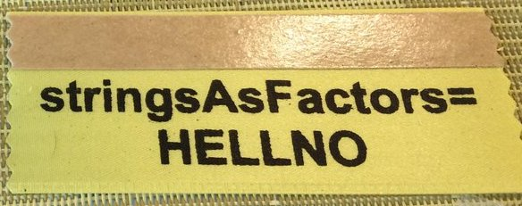
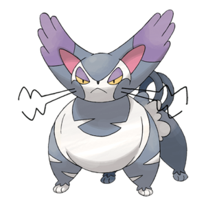
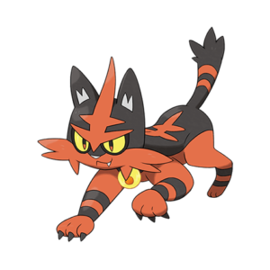

```{r setup, include=FALSE}
library(knitr)
library(tidyverse)
conflicted::conflict_prefer("filter", "dplyr")

options(htmltools.dir.version = FALSE,
        tibble.width = 70,
        ggplot2.continuous.colour = "viridis",
        ggplot2.continuous.fill = "viridis")
opts_chunk$set(
  fig.width = 6.5,
  fig.height = 4.5,
  fig.align = "center",
  cache = TRUE
)
theme_set(theme_minimal() +
            theme(text = element_text(size = 20))) 
```

# What are factors?

R's representation of categorical variable. Consists of:

1. A set of _values_
2. An ordered set of valid _levels_

--

```{r}
eyes <- factor(c("blue", "green", "green"),
               levels = c("blue", "brown", "green"))
eyes
```

---
class: inverse, middle, center

# Some examples

---

# What you see is NOT what you get

```{r}
(treatment <- c(50, 0, 50, 100))
```
--
```{r}
(treatment_f <- factor(treatment))
```
--
```{r}
as.numeric(treatment_f)
```

---

class: middle, center

# Factors are stored as _integers_

---

class: middle

.center[
.img-small[

]]

```{r}
(drinks_a <- factor(c("coffee", "beer", "beer")))
(drinks_b <- factor(c("lemonade", "coffee")))
```

---

class: center, middle

# Factor levels are _alphabetical_ by default

.img-small[

]

---

# Predict the output

```{r eval = FALSE}
drinks_a <- factor(c("coffee", "beer", "beer"))
drinks_b <- factor(c("lemonade", "coffee"))

c(drinks_a, drinks_b) #<<
```
--
```{r echo = FALSE}
c(drinks_a, drinks_b)
```
--

```{r eval = FALSE}
c(drinks_a, "tea") #<<
```
--
```{r echo = FALSE}
c(drinks_a, "tea")
```

--

```{r eval = FALSE}
as.numeric(c(drinks_a, "tea")) #<<
```
--
```{r echo = FALSE}
as.numeric(c(drinks_a, "tea"))
```

---
class: center, middle


---
# Let's take two data frames...

```{r echo = FALSE}
library(tidyverse)
a <- tibble(name = c("Alon", "Ela", "Shaked"),
            drink = factor(c("coffee", "beer", "beer")))

b <- tibble(name = c("Oren", "Erez"),
            drink = factor(c("lemonade", "coffee")))
```

.pull-left[
```{r}
a
b
```
]


---

# We now know that this will fail
.pull-left[
```{r}
a
b
```
]

.pull-right[
```{r}
a$drink
b$drink
```

```{r}
c(a$drink, b$drink) #<<
```
]

---

# But sometimes, R handles factor magic for you...

.pull-left[
```{r}
a
b
```
]

.pull-right[
```{r}
rbind(a, b) #<<
```
]

---

# The tidyverse reminds you to pay attention to types!
.pull-left[
```{r}
a
b
```
]

.pull-right[
```{r}
bind_rows(a, b) #<<
```
]

---

class: center, middle


---

# Why care?

By default, `stringsAsFactors = TRUE` when you use `read.csv()`

Be aware when you:

- try to combine (`c()`) factors
- try to convert to numeric

--

Better practice: Use `stringsAsFactors = FALSE` or `read_csv`. 

**Only use factors when YOU decide it's useful**

---

<blockquote class="twitter-tweet tw-align-center" data-lang="en"><p lang="en" dir="ltr">10 years after convincing all scientists to switch to R: &quot;10% of genetics papers contain error due to stringsAsFactors&quot;</p>&mdash; Austin Richardson (@heyaudy) <a href="https://twitter.com/heyaudy/status/770658444286189569?ref_src=twsrc%5Etfw">August 30, 2016</a></blockquote>
<script async src="https://platform.twitter.com/widgets.js" charset="utf-8"></script>

<blockquote class="twitter-tweet tw-align-center" data-lang="en" style="text-align: center;"><p lang="en" dir="ltr">I hope R&#39;s default stringsAsFactors=TRUE steps on a Lego.</p>&mdash; dr allison barner (@algaebarnacle) <a href="https://twitter.com/algaebarnacle/status/1088932294427996160?ref_src=twsrc%5Etfw">January 25, 2019</a></blockquote>
<script async src="https://platform.twitter.com/widgets.js" charset="utf-8"></script>

<blockquote class="twitter-tweet tw-align-center" data-lang="en"><p lang="en" dir="ltr">How do I hate thee stringsAsFactors = TRUE? Let me count the ways <a href="https://twitter.com/hashtag/rstats?src=hash&amp;ref_src=twsrc%5Etfw">#rstats</a></p>&mdash; Hadley Wickham (@hadleywickham) <a href="https://twitter.com/hadleywickham/status/624349074636976128?ref_src=twsrc%5Etfw">July 23, 2015</a></blockquote>
<script async src="https://platform.twitter.com/widgets.js" charset="utf-8"></script>

---

class: inverse, middle, center

[](https://twitter.com/JennyBryan/status/630052228624068609)

---

class: center, middle


```{r}
library(tidyverse)

# or if you only want to load forcats:
# library(forcats)
```

---

# forcats overview

* `fct_infreq()`: reorder a factor by the frequency of values
* `fct_rev()`: reverse the order of factors
* `fct_relevel()`: change the order of a factor by hand
* `fct_collapse()`: collapse factor levels into manually defined groups
* `fct_lump()`: collapse the least/most frequent values of a factor into "other"
* `fct_reorder()`: reorder a factor by another variable

Source: https://forcats.tidyverse.org/

---

class: center, middle
background-image: url(img/forpoke_with_ball_real.png)
background-position: center
background-size: auto 80%

---

```{r message = FALSE}
# usethis::use_course("http://bit.ly/ecodata-factors-ex")
pokemon <- read_csv("data/pokemon.csv")
```

---

```{r}
# usethis::use_course("http://bit.ly/ecodata-factors-ex")
pokemon
```

---
class: exercise

# Exercise

How many types of pokemon are there?

How many body styles do they have?

.bottom-right[

]

---
Let's get graphing!

```{r eval = FALSE}
theme_set(theme_minimal()) # change the default theme

options(ggplot2.continuous.colour = "viridis", # change the default colors
        ggplot2.continuous.fill = "viridis"))
```

.center[

]
---
exclude: true

```{r}
ggplot(pokemon, aes(weight_kg, height_m)) +
  geom_point() +
  scale_x_log10() +
  scale_y_log10() +
  facet_wrap(.~ body_style)
```

---

```{r}
pokemon %>%
  ggplot(aes(type_1)) +
  geom_bar() + coord_flip()
```

---

```{r}
pokemon %>%
  mutate(type_1 = fct_infreq(type_1)) %>% #<<
  ggplot(aes(type_1)) +
  geom_bar() + coord_flip()
```

---

```{r}
pokemon %>%
  mutate(type_1 = fct_infreq(type_1),
         type_1 = fct_rev(type_1)) %>% #<<
  ggplot(aes(type_1)) +
  geom_bar() + coord_flip()
```

---

```{r}
pokemon %>%
  mutate(type_1 = fct_infreq(type_1),
         type_1 = fct_rev(type_1),
         type_1 = fct_relevel(type_1, "Normal")) %>% #<<
  ggplot(aes(type_1)) +
  geom_bar() + coord_flip()
```

---

class: exercise

# Exercise

How do you make this graph?

```{r exercise-2, echo = FALSE}
pokemon %>% 
  filter(!is.na(type_2)) %>% 
  mutate(type_2 = fct_infreq(type_2) %>% fct_rev()) %>% 
  ggplot(aes(type_2)) +
  geom_bar() + coord_flip()
```

.bottom-right[

]

---

```{r}
pokemon %>% 
  ggplot(aes(body_style)) +
  geom_bar() + coord_flip()
```

---

```{r}
pokemon %>% 
  mutate(body_style = fct_collapse( #<<
    body_style, #<<
    head = c("head_base", "head_only", "head_arms", "head_legs"), #<<
    bipedal = c("bipedal_tailless", "bipedal_tailed") #<<
    )) %>% #<<
  ggplot(aes(body_style)) +
  geom_bar() + coord_flip()
```

---

```{r}
pokemon %>% 
  mutate(body_style = fct_collapse(
    body_style,
    head = c("head_base", "head_only", "head_arms", "head_legs"),
    bipedal = c("bipedal_tailless", "bipedal_tailed")
    ),
    body_style = fct_lump(body_style, 3)) %>% #<<
  ggplot(aes(body_style)) +
  geom_bar() + coord_flip()
```

---

class: exercise

# Exercise

How do you make this graph?

```{r exercise-3, echo = FALSE}
pokemon %>% 
  mutate(body_style = fct_collapse(
    body_style,
    wings = c("two_wings", "four_wings")
  ) %>% 
    fct_lump(4) %>% 
    fct_infreq()) %>% 
  ggplot(aes(body_style)) +
  geom_bar() + coord_flip()
```

.bottom-right[

]

---

```{r}
pokemon %>%
  ggplot(aes(generation, attack)) +
  geom_boxplot()
```

---

```{r}
pokemon %>%
  mutate(generation = factor(generation)) %>% #<<
  ggplot(aes(generation, attack)) +
  geom_boxplot()
```

---

```{r}
pokemon %>%
  mutate(generation = factor(generation)) %>%
  mutate(generation = fct_reorder(generation, attack)) %>% #<<
  ggplot(aes(generation, attack)) +
  geom_boxplot()
```

---

class: exercise

# Discuss

How is `fct_infreq()` different from `fct_reorder()`?  

How are they similar?

.bottom-right[

]

---

```{r}
pokemon %>%
  count(generation, body_style)
```

---

```{r}
pokemon %>%
  count(generation, body_style) %>%
  ggplot(aes(generation, body_style,
             size = n, color = n)) +
  geom_point()
```

---

```{r}
pokemon %>%
  mutate(generation = factor(generation)) %>% #<<
  count(generation, body_style) %>%
  ggplot(aes(generation, body_style,
             size = n, color = n)) +
  geom_point()
```

---

class: middle, center, inverse

# Statistics with factors

---

## Statistical tests that can be used when your response is categorical

1. Chi-square
2. Logistic regression
3. Multinomial logistic regression

---

class: middle, center

## Chi-square 

Tests whether there is a different between the expected and the observed frequencies of one or more categories. 

.small[
In other words, use it when your response and predictor are categorical
]

---

# Example: 

Are electric pokemons are more yellow than expected by chance?

.center[

]
---

.small[
```{r}
#create a table that has the frequency of colors to types of pokemons
chi_data <- table(pokemon$type_1,pokemon$color)
chi_data
```
]
---

```{r}
#run the chi-square test
chi_test <- chisq.test(chi_data)
chi_test
```

---

##### Let's plot the chi-square residuals and find out how type is associated with color
```{r message=FALSE, warning=FALSE, include=FALSE, paged.print=FALSE}
if(!require("ggpubr")) install.packages("ggpubr")
```

```{r}
res <- as.data.frame(chi_test$residuals)
ggpubr::ggballoonplot(res, size = "Freq",fill = "Freq")+
  scale_fill_viridis_c(option = "D")
```

---

class: exercise

# Test whether `grass` egg group pokemons hatch into green adults more than expected by chance


---

class: middle, center

# Logistic regression

A statistical test to study the relationship between a binary response and one or more continious predictors.

At the center of the logistic regression analysis is the task estimating the log odds of an event.

---

## Test assumptions

* The dependent variable should be dichotomous in nature
* There should be no outliers in the data
* here should be no high correlations (multicollinearity) among the predictors

---

## Important to remember

* *Logistic regression is sensative to overfitting* - adding more predictors will alsways increase the varience explained, but too many predictors can create overfitting and reduces the generalizability of the model beyond your data

* *Logistic regresion has a pseudo R-square* - report it with caution because Numerous pseudo-R-square tend to have many computational problems that cause them to be artificially high or low.
A solution: present the results of a goodness of fit test such as Hosmer-Lemeshow

---

# Example:

Does pokemon becomes legendary with the in increase in `speed`, `attack`, and `catch_rate` abilities?

---
.small[
```{r warning = FALSE}
mylogit <- glm(is_legendary ~ speed + attack + catch_rate, data = pokemon, family = "binomial")
summary(mylogit)
```
]
---

class: exercise
##Exercise

Run a logistic regression to see if a pokemon's chance for mega evolution grows with its height, weight, and defense abilities


.bottom-right[

]
---
## Multinomial Logistic Regression

* Used to explain the relationship between one nominal dependent variable and one or more independent variables.
* For a nominal dependent variable with k categories, the multinomial regression model estimates k-1 logit equations
* Multinomial regression is similar to discriminant analysis. The latter should be used if the predictors are normaly distributed.

Bottom line: Use multinomial regression when you have a categorical variable with more than two categories, and your predictors are not normaly distributed.


---

## Example:
We want to know how pokemons' defense, attack, and speed abilities associated with its type 

---
.small[
```{r message=FALSE, warning=FALSE, include=FALSE}
if(!require("nnet")) install.packages("nnet")
```

```{r echo=TRUE, message=FALSE, warning=FALSE, paged.print=FALSE}
library(nnet)
multi_test <- multinom(type_1 ~ defense + attack + speed, data = pokemon)
```
]
---
.small[
```{r}
summary(multi_test)$coefficients/summary(multi_test)$standard.errors
```
]


